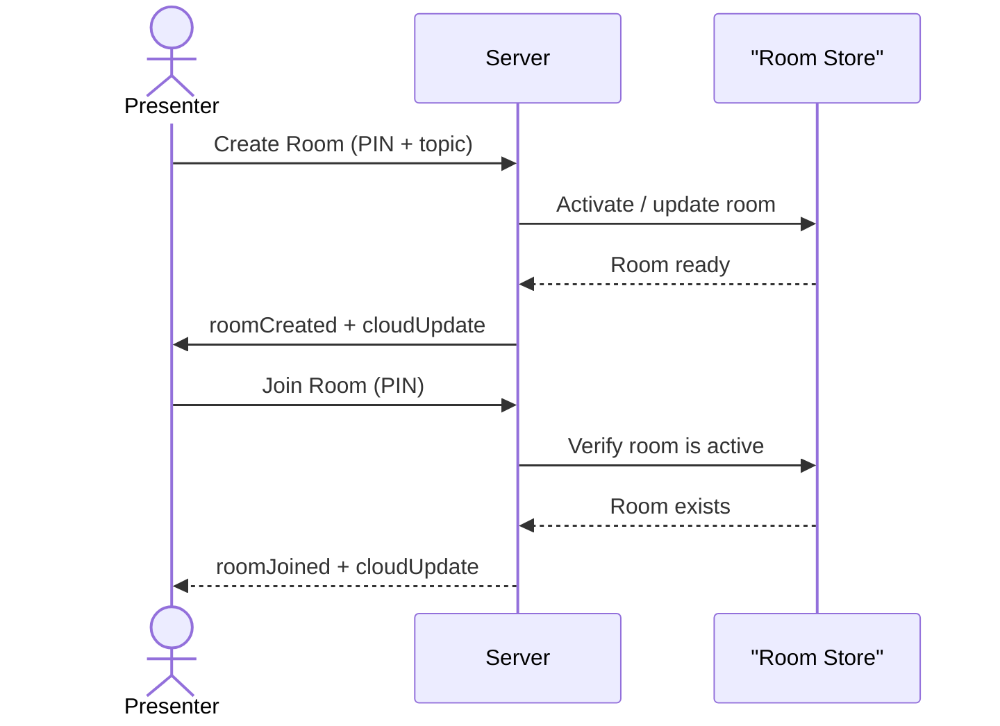

# Micro-Menti

A lightweight, real-time word cloud polling tool that turns audience input into a live, animated word cloud. Perfect for workshops, classrooms, or any meeting where you want to see what the room is thinking, instantly.

## System Design


## Features

### Presenter-controlled Rooms

A presenter creates a room with a PIN and an optional topic. Participants join by entering the PIN. Only the presenter can reset the word cloud.



### Live Word Cloud with Profanity Filter

Participants submit words directly. A built-in filter blocks offensive language. Word counts are updated in memory and broadcast to everyone in the room every 500ms.

```mermaid
sequenceDiagram
    actor Participant
    participant Server
    participant Store as "Word Store"
    participant Loop as "Broadcast Loop"

    Participant->>Server: Submit Word
    Server->>Server: Profanity check
    Server->>Store: Increment word count
    Store-->>Server: Mark changed

    loop Every 500ms
        Loop->>Store: Scan for changed rooms
        Store-->>Loop: Rooms with isChanged
        Loop->>Server: Emit cloudUpdate to room
    end
```

### Automatic State Persistence

All room data and word counts survive server restarts, saved to a local SQLite database. On startup, the server restores the last saved state.

### Idle Room Cleanup

Rooms that have been inactive for more than one hour are automatically removed from memory, preventing memory leaks without any manual intervention.

## Installation

Clone the repository and install dependencies:

```bash
git clone https://github.com/johnsonabiodun313/Micro-Menti.git
cd Micro-Menti
npm install
```

Create a `.env` file with the port you want the server to listen on:

```bash
PORT=3000
```

Start the server:

```bash
npm start
```

For development with automatic restarts:

```bash
npm run dev
```

## Usage

Micro-Menti is a backend service that you integrate with your own frontend. Here's how a typical client would connect and interact:

```js
import { io } from 'socket.io-client';

const socket = io('http://localhost:3000');

// Presenter creates a room
socket.emit('createRoom', { pin: 'ROOM1', topic: 'What is your favourite framework?' });

// Participant joins
socket.emit('joinRoom', 'ROOM1');

// Listen for updates (the word cloud array)
socket.on('cloudUpdate', (cloudArray) => {
  console.log(cloudArray);
  // Render the word cloud on screen
});

// Participant submits a word
socket.emit('submitWord', { roomCode: 'ROOM1', word: 'React' });

// Presenter resets the cloud
socket.emit('resetCloud', 'ROOM1');
```

You can also validate a room code without opening a socket connection by hitting the REST endpoint:

```bash
curl http://localhost:3000/api/room/ROOM1
```

Response:

```json
{
  "valid": true,
  "topic": "What is your favourite framework?"
}
```

## Technologies Used

| Technology | Purpose |
|------------|---------|
| [Express](https://expressjs.com/) | HTTP server and REST endpoints |
| [Socket.io](https://socket.io/) | Real-time bidirectional communication |
| [SQLite3](https://www.sqlite.org/) | Lightweight in-process database for state persistence |
| [bad-words](https://www.npmjs.com/package/bad-words) | Profanity filtering on submitted words |
| [dotenv](https://github.com/motdotla/dotenv) | Environment variable management |
| [cors](https://github.com/expressjs/cors) | Cross-origin resource sharing |

## API Documentation

### GET /health

**Description**: Health check endpoint for uptime monitoring.

**Response**:

```json
{
  "status": "OK",
  "message": "HTTP Server is running"
}
```

### GET /api/room/:code

**Description**: Checks whether a room exists and is active. Useful for validating a PIN before a participant attempts to join.

**Request**: Path parameter `:code` (the room PIN, case-insensitive).

**Response**:

```json
{
  "valid": true,
  "topic": "What is your favourite framework?"
}
```

or

```json
{
  "valid": false
}
```

**Errors**:

- No specific error responses; the endpoint always returns a JSON object with `valid`.

### Socket.io Events

| Event (client emits) | Payload | Description |
|----------------------|---------|-------------|
| `createRoom` | `{ pin, topic }` | Presenter creates or activates a room |
| `joinRoom` | `roomCode` (string) | Participant joins an active room |
| `submitWord` | `{ roomCode, word }` | Participant submits a word to the cloud |
| `resetCloud` | `roomCode` (string) | Presenter clears all words in a room |

| Event (server emits) | Payload | Description |
|----------------------|---------|-------------|
| `roomCreated` | `{ pin, topic }` | Sent to the presenter when a room is created |
| `roomJoined` | `{ pin, topic }` | Sent to a participant after joining |
| `cloudUpdate` | `[{ text, value }, ...]` | Sent to all clients in a room when the word counts change |
| `roomError` | `{ message }` | Sent when a join fails or a word is submitted to an inactive room |

## Environment Variables

| Variable | Default | Description |
|----------|---------|-------------|
| `PORT`   | (required) | Port the HTTP and Socket.io server listens on |

## Contributing

Contributions are welcome. Please open an issue to discuss proposed changes before submitting a pull request.

[](https://dokugen.samueltuoyo.com)
